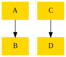
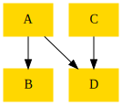
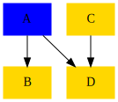
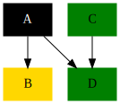

# Dependency Validation

The main purpose of the dependency validation logic is to ensure that parts of the project graph that should not reference each other cannot do so. 

While this is normally only a problem for large projects it also has applications beyond this and can be used for both positive and negative discrimination.

The dependency validator attempts to label parts of the graph in this case by "colouring" them. At the level of the validation logic these colours are simply arbitrary labels. 

Colour is used in this case as an analogy, that hopefully everyone can relate to, which can help us understand the result of merging portions of the graph to produce new valid sections (in this case new colours).

Given the complexity of the project graphs for many of the large repositories colouring the graph allows us to both validate and visualise the dependency graph to help us understand and organise the project dependencies.

## Requirements:

There are number of design principles to the validation logic

1. Validation must be order independent
2. Dependencies are transitively propagated
3. Low configuration
4. Mostly codified in the project system
5. Simple to understand
6. Visualisable

Being order independent ensures that we don't break validation as a result of trivial project reordering or addition. It does however mean that this validation is not suitable for implementing directional dependency validation. It is not possible in this setup to validate that one set of projects can depend on another but not be depended upon, as this is essentially a violation of the ordering constraint. It is possible however to combine groups in such a fashion what we can positively validate that certain dependencies are met.

Whatever validation logic you might pick, you end up trading complexity of both the configuration and algorithm against the different sorts of validation that can be achieved. The current design simply prioritises the validation that I believe we mostly are trying to perform, which is that certain parts of the project graph do not converge, and provides a simple way of ensuring this.

## Implementation

A BaseColour is an arbitrary string label, and a Colour is a set of BaseColours. For example, Blue and Red are BaseColours, and Purple = { Red, Blue } is a Colour. We abuse notation in various places by naming singleton sets after the BaseColour they contain. For example, 'Red' is used to refer to both the BaseColour Red and the Colour { Red }.

The validation runs as follows:

0. The user specifies a colour chart file which defines the set of all valid Colours. The colour Default = {} is always valid, as is { C } for any BaseColour C. Any other valid Colours must be listed explicitly.
1. .csproj and Directory.Build.Props files are checked for Colour properties, which are used to assign a Colour to each project (.csproj properties override Directory.Build.Props properties). If no Colour properties are found then the project is given colour Default. The abuse of notation we mention above is applied here. For example, if the property specifies a colour of Red then the project will be assigned a Colour of { Red }.
2. The set of transitive dependencies of each project is calculated, and the union of the Colours of all of these projects is computed. For example, if P with colour { Red } depends on Q with colour { Blue, Green }, which depends on R with colour { Orange } then the Colour associated with P's set of dependencies is { Red, Blue, Green, Orange }.
3. The Colour computed from the set of transitive dependencies is checked against the list of valid Colours from the colour chart file. If it is not found then the validation fails.

## Examples

### Validate that one project cannot be referenced in another...

Imagine we have two project trees. In our current setup there is nothing to prevent a reference from being added from one to the other:

Valid Configuration|Invalid Reference
:-----------------:|:----------------:
|

If we want to prevent this from happening, we can simply label the two subgraphs with different base colours and this will fail validation. Labelling is achieved by simply adding a `Colour` property to the project.

Step 1 label A as Blue:|Step 2 label D as Green:
:-----------------:|:----------------:
|

Unless you define a valid colour combination of Green and Blue this will always fail validation irrespective of where in A's dependency graph you add a reference to any node coloured as Green.
